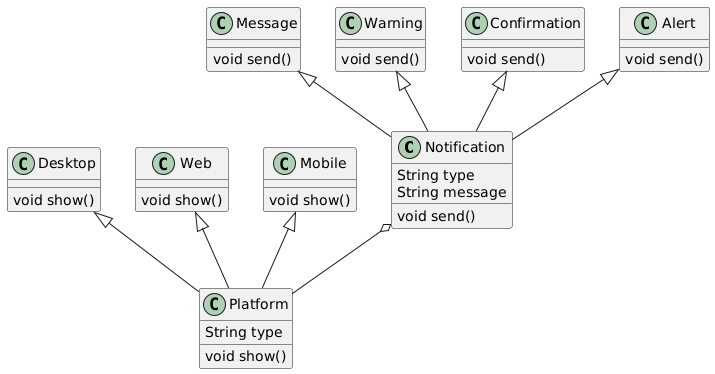

# Patrones de Diseño

## Ejercicio 1

Por hacer

## Ejercicio 2

**Tipo de patrón:** Estructural

**Nombre del patrón:** Bridge (Puente)

_El patrón Bridge es un patrón de diseño estructural que permite dividir una clase grande o un conjunto de clases estrechamente relacionadas en dos jerarquías separadas: abstracción e implementación, que pueden desarrollarse de forma independiente._

Este ejercicio demuestra el patrón Bridge al separar la abstracción (notificaciones) de su implementación (por ejemplo, lógica de visualización específica de la plataforma). Esto permite extender cualquiera de los dos lados de manera independiente.

**Diagrama de Clases**



### Cómo ejecutar

Asegúrate de tener [Node.js](https://nodejs.org/) instalado.

En tu terminal, navega a la carpeta del proyecto y ejecuta:

```bash
node exercise-2/main.js
```

## Ejercicio 3

Por hacer
